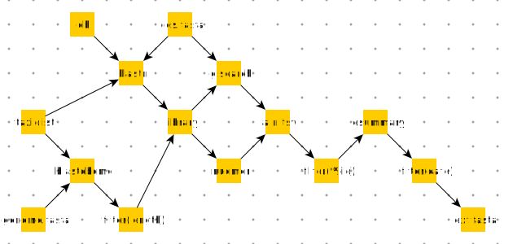

```{r setup, include=FALSE}
# packages
library(tidyverse)
library(lubricity)
library(lubridate)
library(ggtree)
library(tidytree)
library(BactDating)
library(parallel)
library(tracerer)
library(treeio)
library(kableExtra)
# scripts
source("../scripts/util.R")
# options
knitr::opts_chunk$set(echo = F, fig.height = 10, fig.width = 10, fig.align = "center")
# variables
root <- "exp"
```

# Abstract

Members of the *Mastadenovirus* genus include re-emergent, globally-distributed, pathogens with mammalian hosts. Advances in sequencing technology have yielded large, publicly-available data sets that are useful for understanding the genotypes that infect humans. The combination of sequence, isolation date, and location help reconstruct the trajectory of different strains during outbreaks and is crucial for enhancing countermeasure quality. Accordingly, molecular clock techniques cluster samples and estimate divergence times and evolutionary rates. Such data is difficult to assemble and sanitize for large data sets. Thus, the proposed research includes the development of a protocol and automated pipeline that constructs data sets for molecular clock analysis with application to different genotypes. Preliminary analysis compares results to previous studies and tests the hypothesis that external proteins evolve faster than internal ones.

# Introduction

This research relies on molecular clock methods to estimate substitution rates and divergence times in *Mastadenovirus* samples. This requires a highly curated data set of time-stamped, homologous, nucleic acid sequences representative of a measurably evolving population [@drummondMeasurablyEvolvingPopulations2003]. Thus, a preprocessing workflow is necessary to extract and normalize sampling date information. The presence of heterogeneous or ambiguous date formats is a complicating factor and a time sink. Also, manual processing becomes intractable as the number of samples increases and potentially generates costly downstream errors. As a result, this research defines a generic workflow and automated, parallel pipeline that coordinates the execution of preprocessing and analytical tasks in a reproducible manner. This is a preliminary molecular clock study that replicates an HAdV-4 paper and presents the automated characterization of HAdV-55.

## Significance

*Human adenovirus* is a diverse pathogen with global distribution that causes sporadic outbreaks. In 1953, an epidemic occurred at the Fort Leonard Wood U.S. Army installation in Missouri. A patient in a large outbreak presented with pneumonia-like symptoms and provided a throat wash sample that contained the first viral isolate, initially called “adenoid degeneration agent” and later adenovirus [@hlllemanRecoveryNewAgent1954; @roweIsolationCytopathogenicAgent1953]. Subsequent outbreaks resulted in the discovery of and characterization of the *Adenoviridae* family.

The U.S. military vaccinates recruits against genotypes E4 and B7. Recent outbreaks of different genotypes in civilian populations are on the rise. B55 is no exception and increasingly notorious. Data acquired from these outbreaks have yielded data sets suitable for molecular clock analysis. This preliminary research characterizes molecular evolution, testing different clock models and calculating the substitution rate and time to most recent common ancestor (TMRCA). This data helps public health officials make informed decision with respect to biosurveillance efforts and vaccine development for the general population. In addition, these methods are applicable to other emerging types.

## Biology (Summary)

The *Adenoviridae* family includes genera that infect a wide range of hosts and cell types. The *Mastadenovirus* genus includes species that infect mammalian hosts. They are globally distributed, causing sporadic outbreaks in densely populated regions and close-living quarters. Carriers may expose others via aerosol or fecal-oral transmission, potentially asymptomatically [@lynchAdenovirusEpidemiologyGlobal2016]. Symptoms range from acute respiratory disease to organ failure, depending on the viral species and host immune strength [@lynchAdenovirusEpidemiologyGlobal2016]. Accordingly, individuals with developing or weakened immune systems account for most outbreak deaths. The Adenoviridae are class I, linear, double-stranded DNA viruses [@baltimoreExpressionAnimalVirus1971]. The nonenveloped icosahedral nucleocapsid consists of hexon and penton capsomers forming the faces and vertexes respectively. The host coxsackie adenovirus receptor recognizes the fiber knob while the penton RGD motif induces structural changes to gain entry into the host [@petterssonEncountersAdenovirus2019].

## B55

The first B55 samples originated during a 20 year period starting in 1965 at the 302nd Hospital in Beijing, China [@liGeneticRelationshipThirteen1991]. In March 1969, the first military outbreak of B55 occurred at the Sant Climent Sescebes camp of Alt Empordà, Girona, Catalonia, Spain [@hierholzerOCCURRENCERESPIRATORYILLNESS1974]. The virus continues spreading throughout the world, primarily affecting civilian populations. Figure 1 plots date ranges for outbreaks associated with surveillance studies [@caoEmergenceCommunityAcquiredAdenovirus2014; @chmielewiczRespiratoryDiseaseCaused2005; @hierholzerOCCURRENCERESPIRATORYILLNESS1974; @jingHouseholdTransmissionHuman2019; @kajonMolecularEpidemiologyAdenovirus1996; @kajonMolecularSerologicalCharacterization2013; @kajonOutbreakFebrileRespiratory2010; @lafolieSeverePneumoniaAssociated2016; @liGeneticRelationshipThirteen1991; @liOutbreakAcuteRespiratory2014; @luEpidemiologyHumanAdenovirus2014; @salamaOutbreakAdenovirusType2016; @sunEmergentSevereAcute2014; @yiClusterAdenovirusType2017; @yooFebrileRespiratoryIllness2017; @zhuOutbreakAcuteRespiratory2009].

B55 is a re-emergent respiratory pathogen with a B14 genomic backbone and a recombinant hexon partially derived from B11 [@walshComputationalAnalysisIdentifies2010]. A new typing scheme that includes genomic analysis corrected it’s previous misidentification as B11a due to limitations associated with serological assays with respect to recombination effects [@walshComputationalAnalysisIdentifies2010].

## E4

...

## Prior Work

Previous adenovirus research has included molecular clock analysis to characterize outbreak samples. A common protocol involves a preliminary pseudo-statistical test of the strict molecular clock hypothesis followed by Markov chain Monte Carlo (MCMC) simulation to estimate model parameters and unknown uncertainties. Tracing each MCMC run evaluates convergence and determines whether the estimates sample size (ESS) of each parameter of interest is acceptable. A model selection step then compares runs with different clock hypotheses, coalescent models, and substitution models. The result is an estimation of model parameters with confidence intervals, such as divergence times and substitution rates. Recent adenovirus research has featured similar protocols. One paper analyzed B55 isolates between June 2009 and January 2012 in Chongqing, China [@luEpidemiologyHumanAdenovirus2014] and another paper analyzed E4 isolates obtained between 1953 and 2015 in the United States and Japan [@gonzalezGenomicCharacterizationHuman2019].

## Proposed Work

...

## Preliminary Work

...

# Methods



This section documents an executable pipeline that constructs data sets representative of measurably evolving populations and performs molecular clock analysis. The solution relies on Snakemake, which is a portable, rule-based workflow engine [@kosterSnakemakeScalableBioinformatics2012]. Each rule defines a step in the workflow. A rule can also configure its execution environment via the Conda package manager. The engine automatically infers the workflow path and parallelization based on input dependencies, creating a directed acyclic graph [@kosterSnakemakeScalableBioinformatics2012]. Accordingly, the engine guarantees the reproducibility of each step.

## Phase 1: Data Set Generation

The first phase uses a query to generate a set of timestamped, homologous sequences. The execution has two initial paths to process genes and genomes separately. Both paths use different strategies to guarantee full alignment coverage of the query. For genes, the first rule runs the **BLAST+** `blastn` program to perform local alignment and generate a library of sequences and the next rule runs the **FASTA** `glsearch36` program to perform global-local alignment. For genomes, the first rule runs the **BLAST+** `blastdbcmd` program to subset the BLAST database by sequence length, accepting those within a percentage deviation of expected size and the next rule runs the `nucmer` and `show-coords` programs of the **MUMmer** genome alignment suite. Each path generates a report of query coverage identity scores.

The next rule defines a Python program that extracts the accessions from the report. It uses an **Entrez Direct** binding of the `esummary` utility to query **GenBank** and download a JSON file of the metadata. The final rule processes the JSON file and query coverage identity report. It extracts the "collection_date" qualifier and attempts to normalize it into an ISO-8601 string from a list of formats. The rule then accepts sequences based on an identity threshold and successful date extraction.

## Phase 2: Phylogenetic Analyses

The next phase performs phylogenetic analyses on the generated data set. The initial rule runs the `mafft` program to generate a multiple sequence alignment. This program calculates a fast Fourier transform to cluster and progressively align the sequences [@katohMAFFTNovelMethod2002]. It also automatically sets the optimal program execution mode based on input size and reverse-complements any sequence if necessary [@katohMAFFTNovelMethod2002]. Downstream rules process the resulting FASTA file.

Tree inference occurs in a rule that runs the `iqtree` program to infer a maximum-likelihood tree [@nguyenIQTREEFastEffective2015]. The program uses `ModelFinder` to calculate the best substitution model based on the Bayesian information criterion [@kalyaanamoorthyModelFinderFastModel2017]. The "-alrt" and "-bb" flags set the number of bootstrap replicates for the approximate likelihood ratio test of branches and branch support and the "-bnni" flag activates nearest neighbor interchange search optimization strategy [@anisimovaSurveyBranchSupport2011; @hoangUFBoot2ImprovingUltrafast2018]. The program outputs a log file and exports the tree in Newick format.

...

The pipeline also includes a rule to output BEAST model files. The rule executes a custom Python script that transforms the multiple sequence alignment and `ModelTest` result into an XML file that also specifies the sequence and sampling date for each taxon. The script maps the inferred substitution model to a BEAST compatible format. Clock models include the strict clock, relaxed clock with lognormal distribution, and relaxed clock with exponential distribution [@drummondRelaxedPhylogeneticsDating2006]. Tree priors include the Constant Size and Exponential Growth coalescent models [@griffithsSamplingTheoryNeutral1994; @kingmanCoalescent1982]. Also, the script includes specifications to run maximum likelihood estimation using the path sampling stepping stone method with a Beta path step distribution [@baeleAccurateModelSelection2012; @baeleImprovingAccuracyDemographic2012]. 

# Results (Preliminary)

## Automated HAdV-B55 Analysis

```{r}
acc <- "FJ643676.1"

meta <- 
  file.path(root, acc, "meta.json") %>%
  read_file() %>%
  jqr::jq(".result | del(.uids) | map([.accessionversion, .title, .taxid, .organism, .subtype, .subname]) |.[]") %>% 
  textConnection() %>% 
  jsonlite::stream_in(simplifyDataFrame = T, verbose = F) %>%
  setNames(c("accver", "title", "taxid", "organism", "subtype", "subname")) %>%
  bind_cols(
    .,
    bind_rows(
      apply(., 1, function(row) {
        key <- str_split(row["subtype"], "\\|")[[1]]
        val <- str_split(row["subname"], "\\|")[[1]]
        data.frame(as.list(setNames(val, key)), stringsAsFactors = F)
      })
    )
  )

regx_list <- list(
  list(pattern = "(.+)", names = c("cn")),
  list(pattern = "(.+):\\s*(.+)", names = c("cn", "ac1")),
  list(pattern = "(.+):\\s*(.+)", names = c("cn", "ac2")),
  list(pattern = "(.+):\\s*(.+),", names = c("cn", "ac1")),
  list(pattern = "(.+):\\s*(.+),", names = c("cn", "ac2")),
  list(pattern = "(.+):\\s*.+,\\s*(.+)", names = c("cn", "ac1")),
  list(pattern = "(.+):\\s*.+,\\s*(.+)", names = c("cn", "ac2")),
  list(pattern = "(.+):\\s*(.+)\\s*,\\s*(.+)", names = c("cn", "ac1", "ac2")),
  list(pattern = "(.+):\\s*(.+)\\s*,\\s*(.+)", names = c("cn", "ac2", "ac1"))
)

msa <- 
  file.path(root, acc, "msa-1.fna") %>%
  ape::read.dna(format = "fasta", as.character = T) %>%
  toupper()

meta <-
  lapply(rownames(msa), function(ele)
    setNames(
      str_match(ele, "(.+)_(\\d{4}-\\d{2}-\\d{2})$")[1, ],
      c("label", "accver", "date")
    )
  ) %>%
  map_df(bind_rows) %>%
  merge(meta, by = "accver", sort = F) %>%
  bind_cols(bind_rows(lapply(.$country, process_regx_list, regx_list = regx_list))) %>%
  mutate(relabel = str_c(accver, date, cn, taxid, sep = "|")) %>%
  select(label, relabel, everything())

rownames(msa) <- recode(rownames(msa), !!!setNames(meta$relabel, meta$label))

tree <- file.path(root, acc, "gub.final_tree.tre") %>% ape::read.tree()
tree$tip.label <- recode(tree$tip.label, !!!setNames(meta$relabel, meta$label))
tree <- ape::ladderize(tree)
lvls <- tree$tip.label[tree$edge[tree$edge[,2] <= length(tree$tip.label), 2]]

vcf <- 
  bind_rows(merge(call_snp(msa), muts), mutate(call_ind(msa), pos = start)) %>%
  mutate(
    accver = factor(rownames(msa)[idx], levels = lvls), 
    call = factor(call, levels = c("trs", "trv", "sim", "dis", "ins", "del"))
  )

len <- ncol(msa)
colors <- list(trs = "blue", trv = "red", sim = "purple", dis = "orange", ins = "black", del = "black")
shapes <- list(trs = 124, trv = 124, sim = 124, dis = 124, ins = 6, del = 2)

recom <-
  file.path(root, acc, "gub.recombination_predictions.gff") %>%
  ape::read.gff() %>%
  apply(1, function(row) {
    read_delim(str_split(row["attributes"], ";")[[1]], "=", col_names = c("key", "val"), col_types = "cc") %>%
      filter(key == "taxa") %>% pull(val) %>% str_trim() %>% str_split("\\s+") %>% unlist() %>%
      enframe(name = NULL, value = "accver") %>%
      mutate(start = row["start"], end = row["end"])
  }) %>%
  bind_rows() %>%
  mutate(accver = factor(recode(accver, !!!setNames(meta$relabel, meta$label)), levels = lvls)) %>%
  mutate_at(c("start", "end"), as.integer)
```

```{r}
ggplot() +
  geom_point(data = vcf, aes(pos, accver, color = call, shape = call)) +
  geom_rect(
    data = recom,
    aes(
      xmin = start - 0.5, xmax = end + 0.5, 
      ymin = as.numeric(accver) - 0.5, ymax = as.numeric(accver) + 0.5
    ), 
    fill = "lightgrey", color = "black", alpha = 0.25
  ) +
  scale_y_discrete(limits = lvls) +
  scale_color_manual(values = colors) +
  scale_shape_manual(values = shapes) +
  xlim(1, len) +
  theme_minimal() +
  theme(
    legend.position = "bottom",
    text = element_text(family = "mono"),
    axis.text.x = element_text(angle = 90, vjust = 0.5),
    axis.text.y = element_text(hjust = 0)
  )
```

```{r}
df.bf <-
  list.files(root, pattern = ".mle.result.log", recursive = T, full.names = T) %>%
  lapply(parse_mle_report) %>%
  bind_rows() %>%
  mutate(acc = basename(dirname(path)), name = basename(path)) %>%
  separate(name, c("clock", "coal"), sep = "[-.]", extra = "drop") %>%
  group_by(acc) %>%
	mutate(
	  `BF (PS)` = PS - PS[which(clock == "str" & coal == "con")],
		`BF (SS)` = SS - SS[which(clock == "str" & coal == "con")]
	) %>%
  ungroup() %>%
  arrange(acc, desc(`BF (PS)`))
```

```{r}
logs <-
  list.files(root, pattern = "\\w+-\\w+.log", recursive = T, full.names = T) %>%
  grep("(rex|rln|str)-(con|exp).log", ., value = T) %>%
  grep("HAdV-4", ., invert = T, value = T)

pburn <- 0.1

df.ess <-
  mclapply(logs, function(path) {
    df <- parse_beast_log(path)
    interval <- df$state[2] - df$state[1]
    select(df, joint, prior, likelihood, age.root., meanRate, coalescent) %>%
      apply(2, function(ele) calc_ess(remove_burn_in(ele, pburn), interval)) %>%
      c(path = path)
  }) %>%
  map_df(bind_rows) %>%
  mutate(acc = basename(dirname(path)), path = basename(path)) %>%
  select(acc, path, everything()) %>%
  separate(path, c("clock", "coal"), sep = "[-.]", extra = "drop") %>%
  mutate_at(4:ncol(.), as.double)

df.est <- 
  mclapply(logs, function(path) {
    parse_beast_log(path) %>%
      apply(2, median) %>%
      c(path = path)
  }) %>%
  map_df(bind_rows) %>%
  mutate(acc = basename(dirname(path)), path = basename(path)) %>%
  select(acc, path, everything()) %>%
  separate(path, c("clock", "coal"), sep = "[-.]", extra = "drop") %>%
  mutate_at(4:ncol(.), as.double)
```

```{r}
df.res <-
  merge(df.est, df.ess, by = c("acc", "clock", "coal"), suffixes = c(".est", ".ess")) %>%
  merge(df.bf, ., sort = F) 

keys <- paste0(c("joint", "prior", "likelihood", "age.root.", "meanRate", "coalescent"), ".ess")
idx <- (select(df.res, all_of(keys)) >= 200) %>% apply(1, all) %>% which()
```

```{r, warning=FALSE}
tree <-
  df.res[idx, ] %>% .[.$acc == acc, ] %>% head(1) %>%
  with(paste0(clock, "-", coal, ".mcc.tree")) %>%
  file.path(root, acc, .) %>%
  read.beast()
tree@phylo$tip.label <- recode(tree@phylo$tip.label, !!!setNames(meta$relabel, meta$label))
plot_chronogram(tree)
```

```{r}
df.res[idx, ] %>% .[.$acc == acc, ] %>% head(1) %>%
  with(paste0(clock, "-", coal, ".log")) %>%
  file.path(root, acc, .) %>%
  parse_beast_log() %>%
  select(state, joint, prior, likelihood, age.root., meanRate, coalescent) %>%
  filter(state >= max(state) * pburn) %>%
  pivot_longer(2:ncol(.), names_to = "statistic") %>%
  ggplot(aes(state, value)) + 
    geom_path() + 
    facet_wrap(~ statistic, ncol = 1, scales = "free_y", strip.position = "right") +
    theme_minimal()
```

```{r}
select(df.res, acc, `BF (PS)`, clock, coal, starts_with(c("age.root.", "meanRate")), -path, -state) %>%
  knitr::kable("html", col.names = c("acc", "BF (PS)", "clock", "coal", c("est" ,"ess", "est" ,"ess"))) %>%
  add_header_above(c(" " = 2, "model" = 2, "age(root)" = 2, "mean(rate)" = 2)) %>%
  row_spec(idx, bold = T)
```

## Replication of HAdV-4 Paper

```{bash, script}
mkdir -p exp/HAdV-4 && cd exp/HAdV-4

# efetch
[ ! -f rec.fna ] && awk 'NR > 1 { print $1; }' meta.tsv | tr '\n' ',' | xargs efetch -db nuccore -format fasta -id > rec.fna

# meta
awk -F '\t' 'NR > 1 { printf "/^>/ s/%s/%s_%s_%s/\n", $1, $1, $4, $5; }' meta.tsv > meta.sed

# mafft
[ ! -f msa-1.fna ] && 
sed '/^>/ s/ .*//' rec.fna | sed -f meta.sed | mafft --auto --adjustdirection --thread -1 - > msa-1.fna 2> msa-1.log

# gubbins
sed '/^[^>]/ s/[^acgtACGT-]/N/g' msa-1.fna > msa-2.fna
[ ! -f gub.log ] && run_gubbins.py --prefix gub --iterations 1000 --threads 16 msa-2.fna > gub.log
bedtools maskfasta -fi msa-1.fna -fo msa-2.fna -bed gub.recombination_predictions.gff

# iqtree
[ ! -f phy.log ] && iqtree -s msa-2.fna -pre phy -alrt 1000 -bb 1000 -bnni -nt 16 > /dev/null 2> /dev/null

# beautify
line=( $(
  grep -v WARNING phy.log | awk '{{$1=$1;}} //1;' | \
    grep -A 131 '1 JC' | grep -v +R | sort -n -k 7 | head -n 1 | \
    sed -e 's/+G4/+G/g' -e 's/+F//g'
) );
for clock in "rex" "rln" "str"; do
  for coal in "con" "exp"; do
    echo ../../../../workflow/scripts/beautify.py \
      -dregex "_(\d{4})_" -dformat "%Y" -len_mcmc 100000000 -stem "$clock-$coal" \
      msa-2.fna ../../../../workflow/templates "${line[1]}" "$clock" "$coal" > "$clock-$coal.xml"
  done
done
```

```{r}
subroot<- "HAdV-4"

msa <- 
  file.path(root, subroot, "msa-1.fna") %>%
  ape::read.dna(format = "fasta", as.character = T) %>%
  toupper()

tree <- file.path(root, subroot, "gub.final_tree.tre") %>% ape::read.tree()
tree <- ape::ladderize(tree)
lvls <- tree$tip.label[tree$edge[tree$edge[,2] <= length(tree$tip.label), 2]]

vcf <- 
  bind_rows(merge(call_snp(msa), muts), mutate(call_ind(msa), pos = start)) %>%
  mutate(
    accver = factor(rownames(msa)[idx], levels = lvls), 
    call = factor(call, levels = c("trs", "trv", "sim", "dis", "ins", "del"))
  )

len <- ncol(msa)
colors <- list(trs = "blue", trv = "red", sim = "purple", dis = "orange", ins = "black", del = "black")
shapes <- list(trs = 124, trv = 124, sim = 124, dis = 124, ins = 6, del = 2)

recom <-
  file.path(root, subroot, "gub.recombination_predictions.gff") %>%
  ape::read.gff() %>%
  apply(1, function(row) {
    read_delim(str_split(row["attributes"], ";")[[1]], "=", col_names = c("key", "val"), col_types = "cc") %>%
      filter(key == "taxa") %>% pull(val) %>% str_trim() %>% str_split("\\s+") %>% unlist() %>%
      enframe(name = NULL, value = "accver") %>%
      mutate(start = row["start"], end = row["end"])
  }) %>%
  bind_rows() %>%
  mutate_at("accver", factor, levels = lvls) %>%
  mutate_at(c("start", "end"), as.integer)
```

```{r}
ggplot() +
  geom_point(data = vcf, aes(pos, accver, color = call, shape = call)) +
  geom_rect(
    data = recom,
    aes(
      xmin = start - 0.5, xmax = end + 0.5, 
      ymin = as.numeric(accver) - 0.5, ymax = as.numeric(accver) + 0.5
    ), 
    fill = "lightgrey", color = "black", alpha = 0.25
  ) +
  scale_y_discrete(limits = lvls) +
  scale_color_manual(values = colors) +
  scale_shape_manual(values = shapes) +
  xlim(1, len) +
  theme_minimal() +
  theme(
    legend.position = "bottom",
    text = element_text(family = "mono"),
    axis.text.x = element_text(angle = 90, vjust = 0.5),
    axis.text.y = element_text(hjust = 0)
  )
```

```{r}
df.bf <-
  file.path(root, subroot) %>%
  list.files(pattern = ".mle.result.log", recursive = T, full.names = T) %>%
  lapply(parse_mle_report) %>%
  bind_rows() %>%
  mutate(acc = basename(dirname(path)), name = basename(path)) %>%
  separate(name, c("clock", "coalescent"), sep = "[-.]", extra = "drop") %>%
  group_by(acc) %>%
	mutate(
	  `BF (PS)` = PS - PS[which(clock == "str" & coalescent == "con")],
		`BF (SS)` = SS - SS[which(clock == "str" & coalescent == "con")]
	) %>%
  ungroup() %>%
  arrange(acc, desc(`BF (PS)`))

logs <-
  file.path(root, subroot) %>%
  list.files(pattern = "\\w+-\\w+.log", recursive = T, full.names = T) %>%
  grep("(rex|rln|str)-(con|exp).log", ., value = T)

pburn <- 0.1

df.ess <-
  mclapply(logs, function(path) {
    df <- parse_beast_log(path)
    interval <- df$state[2] - df$state[1]
    select(df, joint, prior, likelihood, age.root., meanRate, coalescent) %>%
      apply(2, function(ele) calc_ess(remove_burn_in(ele, pburn), interval)) %>%
      c(path = path)
  }) %>%
  map_df(bind_rows) %>%
  mutate(path = basename(path)) %>%
  select(path, everything()) %>%
  separate(path, c("clock", "coalescent"), sep = "[-.]", extra = "drop") %>%
  mutate_at(3:ncol(.), as.double)

df.est <-
  mclapply(logs, function(path) {
    parse_beast_log(path) %>%
      apply(2, median) %>%
      c(path = path)
  }) %>%
  map_df(bind_rows) %>%
  mutate(path = basename(path)) %>%
  select(path, everything()) %>%
  separate(path, c("clock", "coalescent"), sep = "[-.]", extra = "drop") %>%
  mutate_at(4:ncol(.), as.double)

df.res <-
  filter(df.ess, joint >= 200, prior >= 200, likelihood >= 200) %>%
  select(clock, coalescent) %>%
  merge(df.bf) %>%
  merge(df.est) %>%
  select(clock, coalescent, `BF (PS)`, age.root., meanRate) %>%
  arrange(desc(`BF (PS)`))
```

```{r, warning=FALSE}
tree <-
  with(df.res[1,], paste0(clock, "-", coalescent, ".mcc.tree")) %>%
  file.path(root, subroot, .) %>%
  read.beast()

tip.date <- str_match(tree@phylo$tip.label, "_(\\d{4})_")[, 2]
ggtree(tree, mrsd = paste0(min(tip.date), "-01-01")) +
  geom_tiplab(linesize = 1, align = T, color = "black") +
  geom_range("height_0.95_HPD") +
  theme_tree2() +
  theme(
    legend.position = "bottom",
    panel.grid.major.x = element_line(color="black", size = .25),
    panel.grid.minor.x = element_line(color="grey", size = .25)
  )
```

```{r}
knitr::kable(df.res, "html")
```

# Timeline

# References
